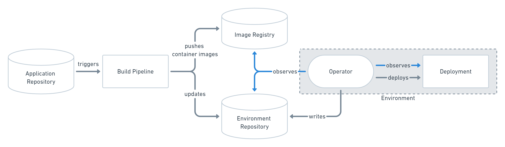

# DecompileD 2021: GitOps using Flux

Repository for my talk at **DecompileD 2021** about GitOps using Flux on the 24. September 2021.

- GitHub: [ricoberger/decompiled2021-gitops-using-flux](https://github.com/ricoberger/decompiled2021-gitops-using-flux)
- Presentation: [GitOps using Flux: How we manage Kubernetes clusters at Staffbase](./assets/decompiled-gitops-using-flux.pdf)
- Twitter: [@rico_berger](https://twitter.com/rico_berger)

## What is GitOps?

> GitOps is a way to do Kubernetes cluster management and application delivery. It works by using Git as a single source of truth for declarative infrastructure and applications. With Git at the center of your delivery pipelines, developers can make pull requests to accelerate and simplify application deployments and operations tasks to Kubernetes.



> Flux is a tool for keeping Kubernetes clusters in sync with sources of configuration (like Git repositories), and automating updates to configuration when there is new code to deploy.

## Demo

Create a new Kubernetes cluster using [kind](https://kind.sigs.k8s.io) and a Docker registry:

```sh
./kubernetes/create-cluster.sh
```

Build the Docker image of our example application (can be found in the `http-server` directory) and push the Docker image into our registry:

```sh
docker build -f ./http-server/Dockerfile -t localhost:5000/server:v1 .
docker push localhost:5000/server:v1

# The following command can be used to run the Docker image on your local machine:
docker run -it --rm --name server -p 8080:8080 localhost:5000/server:v1
```

Deploy the Source, Kustomize and Helm controller for Flux:

```sh
kubectl apply -f kubernetes/namespaces/flux-system/flux-system-clusterrole.yaml
kubectl apply -f kubernetes/namespaces/flux-system/flux-system-clusterrolebinding.yaml
kubectl apply -f kubernetes/namespaces/flux-system/flux-system-crds.yaml
kubectl apply -f kubernetes/namespaces/flux-system/flux-system-ns.yaml
kubectl apply -f kubernetes/namespaces/flux-system/helm-controller-deploy.yaml
kubectl apply -f kubernetes/namespaces/flux-system/helm-controller-sa.yaml
kubectl apply -f kubernetes/namespaces/flux-system/helm-controller-svc.yaml
kubectl apply -f kubernetes/namespaces/flux-system/kustomize-controller-deploy.yaml
kubectl apply -f kubernetes/namespaces/flux-system/kustomize-controller-sa.yaml
kubectl apply -f kubernetes/namespaces/flux-system/kustomize-controller-svc.yaml
kubectl apply -f kubernetes/namespaces/flux-system/source-controller-deploy.yaml
kubectl apply -f kubernetes/namespaces/flux-system/source-controller-sa.yaml
kubectl apply -f kubernetes/namespaces/flux-system/source-controller-svc.yaml
```

Deploy the `GitRepository` CR, for the `github.com/ricoberger/decompiled2021-gitops-using-flux` GitHub repository, to manage the Kubernetes cluster via Git:

```sh
yq eval kubernetes/namespaces/flux-system/gitrepository-cr.yaml
kubectl apply -f kubernetes/namespaces/flux-system/gitrepository-cr.yaml
kubectl get gitrepositories.source.toolkit.fluxcd.io -A
```

```
NAMESPACE     NAME      URL                                                                  READY   STATUS                                                            AGE
flux-system   cluster   https://github.com/ricoberger/decompiled2021-gitops-using-flux.git   True    Fetched revision: main/0a111b4f497f29f052ef2cc6a6b31c7f3dc1c5df   14m
```

Deploy the `HelmRepository` which is needed to deploy the NGINX Ingress Controller via Helm:

```sh
yq eval kubernetes/namespaces/flux-system/helm-repository-cr.yaml
kubectl apply -f kubernetes/namespaces/flux-system/helm-repository-cr.yaml
kubectl get helmrepositories.source.toolkit.fluxcd.io -A
```

```
NAMESPACE     NAME            URL                                          READY   STATUS                                                       AGE
flux-system   ingress-nginx   https://kubernetes.github.io/ingress-nginx   True    Fetched revision: 5cdf3fe499dbfd6bbf8a639d18d4f88736a08e37   18m
```

Deploy the `Kustomization` to apply all changes made in Git to our Kubernetes cluster:

```sh
yq eval kubernetes/namespaces/flux-system/kustomization-cr.yaml
kubectl apply -f kubernetes/namespaces/flux-system/kustomization-cr.yaml
kubectl get kustomizations.kustomize.toolkit.fluxcd.io -A
```

```
NAMESPACE     NAME            READY   STATUS                                                            AGE
flux-system   cluster         True    Applied revision: main/0a111b4f497f29f052ef2cc6a6b31c7f3dc1c5df   4m56s
flux-system   flux-system     True    Applied revision: main/0a111b4f497f29f052ef2cc6a6b31c7f3dc1c5df   75s
flux-system   http-server     True    Applied revision: main/0a111b4f497f29f052ef2cc6a6b31c7f3dc1c5df   75s
flux-system   ingress-nginx   True    Applied revision: main/0a111b4f497f29f052ef2cc6a6b31c7f3dc1c5df   75s
```

Delete the create Kubernetes cluster and Docker registry:

```sh
kind delete cluster --name decompiled
docker stop kind-registry
docker rm kind-registry
```
